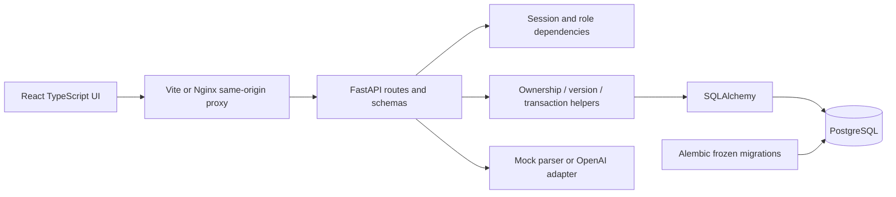
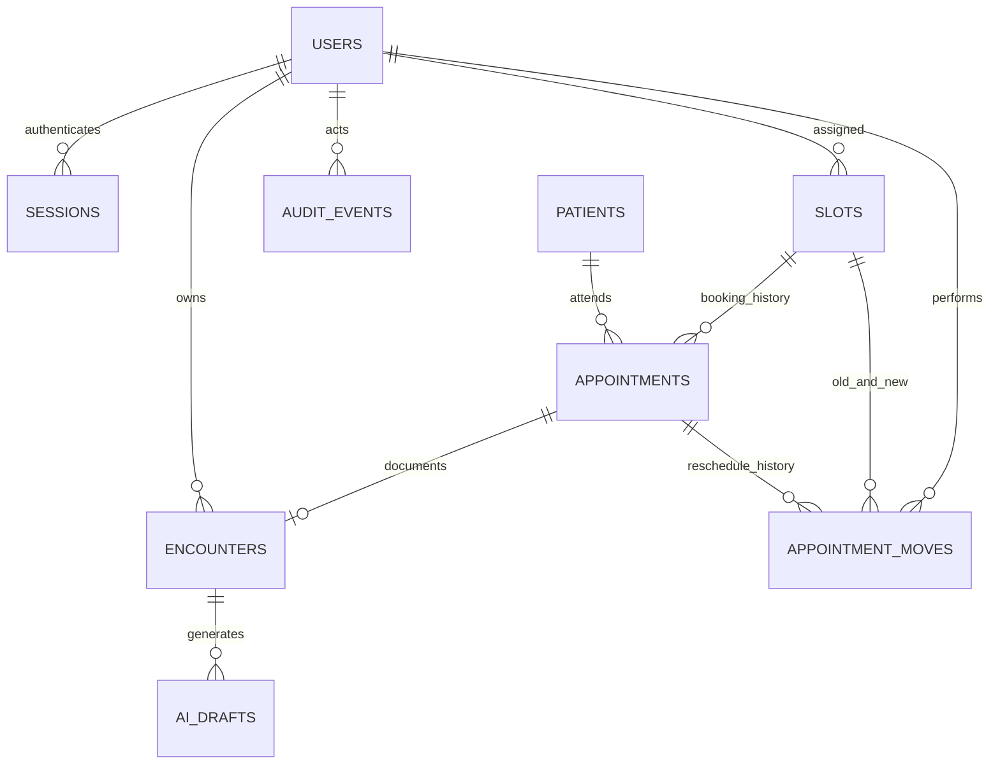
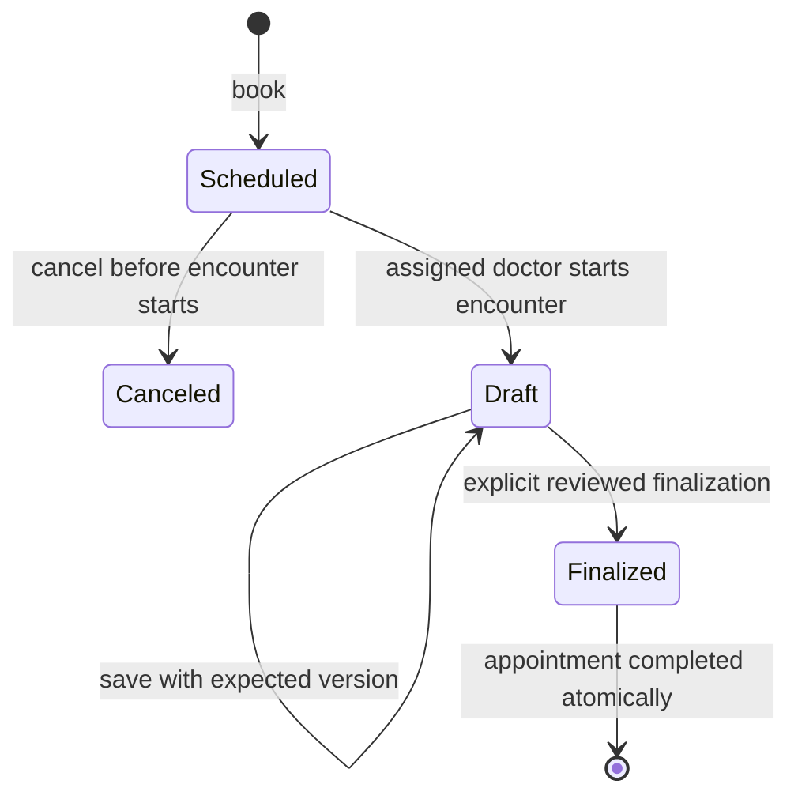

# Architecture and decisions

UUIDs identify domain records. The UI displays a `CF-` prefix and shortened patient UUID, but APIs and relations use the complete ID. PostgreSQL stores timezone-aware timestamps; display and day filtering use Asia/Kolkata. A slot represents 30 minutes. Doctor/start uniqueness and whole/half-hour checks prevent overlapping fixed slots. Foreign keys preserve referential integrity. Session secrets are randomly generated and stored only as SHA-256 digests; Argon2id hashes protect passwords.

## Permission model

| Action | Receptionist | Doctor | Administrator |
|---|---|---|---|
| Demographic registration/edit | Yes | No | No |
| Patient search/read | All clinic patients | Non-canceled assigned care relationship | No |
| Book/cancel/reschedule | Yes | No | No |
| Rescheduling history | Yes | No | Yes |
| Appointment list | All | Assigned only | Operational metadata |
| Read/edit/finalize notes | No | Own only | No |
| Staff and slot creation | No | No | Yes |
| Restricted audit metadata | No | No | Yes |

Backend dependencies enforce role checks before workflow logic. Record checks also apply to changed IDs and direct requests. A patient's care relationship is an assigned scheduled/completed appointment. A doctor can see that patient's demographics but cannot see another doctor's encounter. Completed appointments retain the relationship. Canceled visits do not create one. Deactivated staff cannot authenticate, and role/status changes invalidate their sessions. Doctor roles with assigned slots cannot be removed; deactivate the account instead. An administrator cannot remove their own access.

## Booking transactions

`one_active_booking_per_slot` is a **partial unique PostgreSQL index** on `appointments.slot_id` where `status <> 'canceled'`. Completed visits still occupy historical slots. The booking route inserts the booking and audit row in one transaction. PostgreSQL arbitrates concurrent inserts using the unique index; a loser rolls back and receives 409. The frontend disables in-flight buttons, but the database remains the authority. A repeated successful request receives 409 instead of a duplicate active booking; this is conflict-safe retry behavior, not idempotent response replay.

Cancellation locks the appointment, validates its state, changes status, records its reason and audit event, and commits. The original row stays in history. The index excludes it after commit, permitting a fresh booking. Cancellation is refused after an encounter starts. Starting and canceling both lock the same appointment, so they cannot race past their preconditions. PostgreSQL documents the underlying [partial-index mechanism](https://www.postgresql.org/docs/current/indexes-partial.html).

## Rescheduling transaction and retries

`app/scheduling.py` changes the existing appointment's `slot_id`; it never cancels and replaces the appointment. Migration 002 adds a version initialized to 1, an `appointment_moves` table, and nullable audit details. Existing bookings and clinical relationships are preserved.

Lock order is appointment `FOR UPDATE`, old/new slots sorted by ID `FOR UPDATE`, then the assigned doctor `FOR SHARE`. Cancellation and encounter creation lock the same appointment. A submitted expected appointment version rejects a second concurrent edit instead of silently moving it twice. Cancellation accepts an optional version for backward compatibility; the UI always supplies it. Legacy cancellation without a version serializes against the latest booking. Encounter creation increments the appointment version; if it wins first, the move fails. If a move wins first, the doctor can validly start an encounter on the moved appointment.

The target must differ, be in the future, belong to the same active doctor, and have no non-canceled booking. No encounter may exist. The availability query improves the error message; the existing PostgreSQL partial unique index is still the final arbiter, including races with ordinary booking requests. One transaction changes the slot/version, stores move history, and appends `appointment.rescheduled` with actor, timestamp, old/new slot and time, and reason. A conflict or later audit failure rolls everything back, leaving the original booking intact. Integrity conflicts and PostgreSQL deadlock/serialization/lock-not-available errors are translated to 409.

Every move requires a client-generated UUID `request_id`. Uniqueness is scoped to `(appointment_id, request_id)`. After locking the appointment, the service first checks a previously committed request. Identical actor/target/reason/expected-version returns the saved result with `replayed: true` without another history or audit event, even if the appointment has changed again. That response describes the original operation, **not the current appointment**; refresh the day list. Reuse with different details returns 409. Failed requests have no committed key and can be retried; if someone else changed the appointment, reload and submit a new request with its current version. The UI retains the UUID while the panel stays open and the payload is unchanged. Reloading the page loses that in-memory UUID, so refresh current state before trying again. History/audit APIs expose no clinical bodies; reasons are operational text and should contain no clinical details.

Slots have no edit/delete API, so historical slot references retain their original times. A role change/deactivation locks the doctor row and cannot interleave unnoticed with a successful move. Concurrent tests use separate clients/database connections, including same-target competition, same-appointment edits, cancellation, encounter creation, exact retries, and injected audit failures.

## Encounter transitions

The appointment stays `scheduled` while its encounter is `draft`. Each save locks the encounter and compares the client's expected version; mismatches return 409 and preserve the stored content. A lock plus version predicate implements optimistic client concurrency with serialized writes. Finalization requires at least one reviewed field, increments the version, records the timestamp, sets the appointment to completed, and appends the audit event in one commit. Failures roll back all writes. Finalized records reject save/generate/finalize mutations. Amendments are intentionally absent in v1.

## AI boundary and failure handling

1. Authorize the assigned doctor and validate nonempty source, size, draft state, and expected version.
2. Lock the encounter; increment generation sequence; persist a pending `AI_Draft` with source version and provider model; commit.
3. Call the provider **outside any database transaction**. A synchronous request occupies a worker thread; it does not hold a database lock while waiting.
4. Lock/reload the encounter. If its version, latest generation sequence, or state changed, mark the response stale. Otherwise mark it succeeded or failed.
5. Return the separate draft. Nothing copies into original or reviewed notes until an explicit UI action; only a doctor can finalize.

Mock parsing is deterministic. Live requests use a system instruction, an untrusted JSON-encoded source note, and strict JSON schema. Embedded note instructions have no authority; the mock does not execute them. This boundary is not a proof against model prompt injection or factual errors. JSON schemas validate structure, not truth. Live errors are sanitized; network timeouts, 429, and 5xx get at most three attempts. Invalid output and nontransient HTTP errors do not retry. Timeout is configurable per attempt. Note contents, keys, credentials, or session secrets are not intentionally logged. A process crash may leave a pending draft; no automatic recovery queue is implemented.

The live prompt explicitly accepts unlabeled source, preserves uncertainty/negation/contradictions, distinguishes reported statements from objective observations, and prohibits adding diagnoses, medications, dosages, or plans. Requests set `store: false` and `max_completion_tokens`; refusals and truncated responses fail validation. None of these instructions establishes factual correctness. The evaluator deliberately uses only one attempt per case, reserves a conservative per-request cost before each call, limits request count/output tokens, and refuses missing authorization, stale pricing, or missing local credentials. Software tests use HTTP fakes; the evaluation report keeps automated hints separate from unperformed human review.

## Security and operational trade-offs

Session cookies are HttpOnly, SameSite=Strict, path `/api`, with an eight-hour absolute lifetime. Production sets Secure. Logout deletes the server-side session. Writes require both an exact allowed Origin and a per-session CSRF token in `X-CSRF-Token`; login also checks Origin. The React app keeps CSRF in memory and uses credentialed cookies, never localStorage tokens. Same-origin proxies simplify deployment. Nginx adds a restrictive CSP and basic content/referrer headers.

Local Compose publishes only loopback ports and does not expose PostgreSQL. Demo seeding refuses production mode. Account enumeration responses are generic, with a dummy Argon2 verification for unknown users. Login throttling, MFA, password reset, fine-grained clinician coverage, operational monitoring, backup/restore policy, and regulatory compliance are outside this demonstration. The application database user owns its tables locally; database-level immutable audit enforcement is not claimed.

Business checks are concentrated in route workflows plus `services.py`; `db.py`, models, input/output schemas, security, and AI adapters have separate responsibilities. This keeps a small project inspectable. If the routes grow, extract individual booking and encounter services rather than introducing distributed services.
